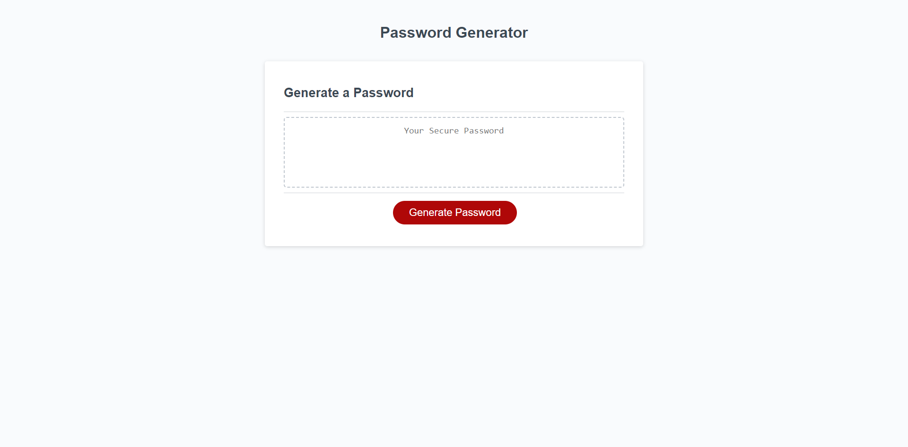

# Password-Gen

## Description

My intention in building this Password Generator was to allow for users to generate a password with a given criteria.

Some of the issues I was able to resolve were,

- Only accepting inputs between the required password length otherwise return false.
- Defining all characters so that the code can choose what characters to include in the generated password.
- Mixing up the string to generate a password based on the given criteria.

## Instructions

1. Click the "Generate Password" button
2. Input the length of your desired password (Between 8-128)
3. Answer the OK (Yes) and Cancel (No) prompts to include the different character types
4. If the criteria is completed then the generated password will print in the "Your Secure Password" box.

    

You can access the web application here: https://cyrus212.github.io/Password-Gen/